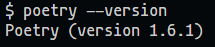

# Setting
Configuraciones necesarias para arrancar el proyecto en el local
## Requisitos previos

Python 3.10+
Poetry

## Pasos para preparar el entorno
Clona el proyecto con el siguiente comando
`git clone https://github.com/No-Country/s13-19-m-python`

Crea un archivo `.env` donde se guardan las variables de entorno y demas, guardalo en la carpeta
de `backend`.

----
### Poetry config

Instalas Poetry con el siguiente comando:

```
pip install poetry
```
> 📝 **Note:** NO hacer `python -m venv venv` o algo como eso, Poetry se encarga de los paquetes.

Despues de haber instalado **Poetry**, escribe esto en la terminal



Una vez verificado que lo tienes instalado, agrega la siguiente configuracion en la terminal

```sh
poetry config virtualenvs.in-project true
```

Luego instalas dependencias con el siguiente comando:

```sh
poetry install
# Luego para iniciar el entorno virtual
poetry shell
```

### Pre-commit config

Arranca el siguiente comando para configurar el **pre-commit**
```sh
poetry run pre-commit install
```

### Arrancar server

Arranca el servidor de Django.

```sh
python manage.py runserver
```
